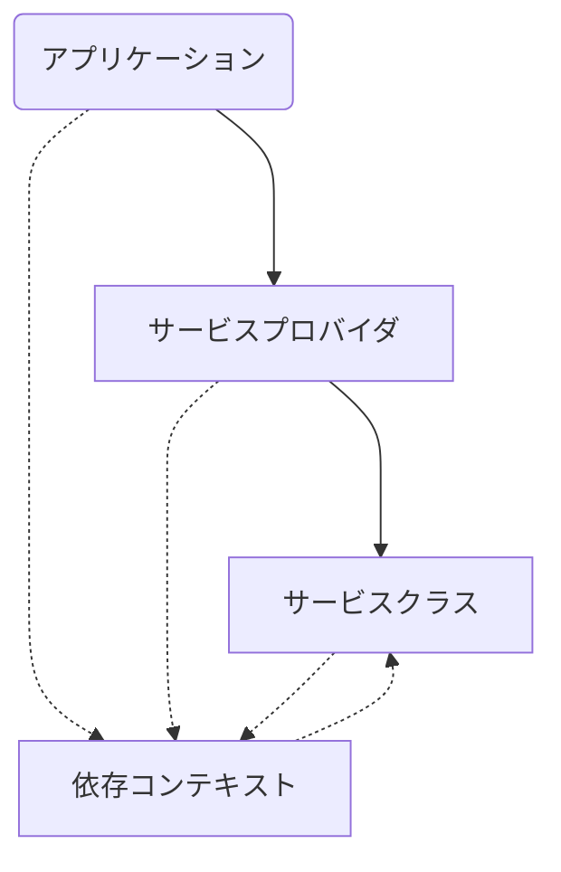

```
       _                     _ _
 _ __ (_) ___ ___         __| (_)
| '_ \| |/ __/ _ \ _____ / _` | |
| |_) | | (_| (_) |_____| (_| | |
| .__/|_|\___\___/       \__,_|_|
|_|
```

  Tiny DI framework for Node.js & Deno.

  [](https://badge.fury.io/js/pico-di)
  [](https://socket.dev/npm/package/pico-di)

---

  Node.js もしくは Deno に型付きの依存性注入 (DI) サポートを追加し、<br />
  クラス (サービス) とそれら依存先との間で制御の反転 (IoC) を実現します。

  .NET DI に着想を得ました:

- [.NET 依存関係の挿入](https://learn.microsoft.com/en-us/dotnet/core/extensions/dependency-injection)

```ts
// ~/services/index.ts

import { createProvider } from "pico-di";
import Service1 from "./Service1";
import Service2 from "./Service2";
import Service3 from "./Service3";

type Context = {
	service1: Service1,
	service2: Service2,
	service3: Service3,
};

const provider = createProvider<Context>(builder => builder
	.addSingleton("service1", Service1)
	.addScoped("service2", Service2)
	.addTransient("service3", Service3));

export {
	type Context,
	type Service1,
	type Service2,
	type Service3,
	provider,
}
```

  アプリケーション側:

```ts
import { provider } from "./services";

const { service1, service2, service3 } = provider.begin();

// ... この後サービスを使って何かする ...
```

## Features

  `pico-di` には以下の機能があります:

  - 型付きコンストラクタインジェクション
  - スコープによるサービスライフタイム管理
  - 依存関係の自動解決とその違反検知

  また、追加のパッケージを使うと [Remix](https://remix.run/) (+ express) 環境に `pico-di` を組み込むことができます。

  - [`pico-di-remix-express`](https://github.com/ydipeepo/pico-di-remix-express)

## Installation

  Node.js と Deno に対応しています。

  **Node.js**

  [npm](https://www.npmjs.com/) から入手できます。インストールするには:

  ```bash
  $ npm install pico-di
  ```

  **Deno**

  npm インポートします:

  ```ts
  import { createProvider } from "npm:pico-di@latest";
  ```

## Usage

  `pico-di` ではプロバイダ (`ServiceProvider`) とスコープ (`ServiceScope`) とレジストリ (`ServiceRegistry`)、依存コンテキストという 4 つの単位を使い IoC を実現します。

  **レジストリ (`ServiceRegistry`)**

  サービスとその寿命を含むディスクリプタが含まれます。`ServiceProvider` に含めます。

  **プロバイダ (`ServiceProvider`)**

  シングルトンサービスはプロバイダに固有になるよう管理されます。サービススコープを作成するためのメソッドを公開します。

  **スコープ (`ServiceScope`)**

  プロバイダから作成します。スコープドサービスはこのスコープに固有になるよう管理されます。依存コンテキストを作成するためのメソッドを公開します。

  **依存コンテキスト**

  スコープから作成します。レジストリに登録されたサービスインスタンスを含む、型付き辞書のように振る舞うオブジェクトです。スプレッドして使います。

```ts
const context = provider.begin(); // = provider.beginScope().createContext()
const { service1, service2 } = context;
```

  スプレッド等によりアクセスされると自動的にインスタンスを生成もしくはキャッシュから照会します。サービス依存関係も自動的に解決されます。

### プロバイダの作成

  プロバイダを作成するためには、プロバイダが提供するサービスクラス、それらを含めた依存コンテキストが必要です。

```ts
import { createProvider } from "pico-di";

// サービスタイプ。
class Service1 { constructor() { console.log(Service1.name); } }
class Service2 { constructor({ service1 }: Context) { console.log(Service2.name); } }
class Service3 { constructor({ service1, service2 }: Context) { console.log(Service3.name); } }

// 依存コンテキスト型。このプロバイダに含めるすべてのサービスを
// name: Type ペアとして含めます。
type Context = {
	service1: Service1,
	service2: Service2,
	service3: Service3,
};

// プロバイダ。ビルダを通して依存コンテキストに含めた全てのサービスを登録します。
// クラスコンストラクタやファクトリ関数を登録できます。
const provider = createProvider<Context>(builder => builder
	.addSingleton("service1", Service1)
	.addScoped("service2", Service2)
	.addTransient("service3", context => new Service3(context)));
```

  ビルダには 3 種類のメソッドがあります。

* `.addSingleton(name, target)`:<br />
  シングルトンサービスとして登録します。シングルトンサービスとして登録されたサービスは、プロバイダ内で固有となるよう寿命が管理されます。<br />

* `.addScoped(name, target)`:<br />
  スコープドサービスとして登録します。スコープドサービスとして登録されたサービスは、スコープ内で固有となるよう寿命が管理されます。

* `.addTransient(name, target)`:<br />
  トランジェントサービスとして登録します。トランジェントサービスとして登録されたサービスは、依存コンテキストを通してアクセスされる毎に新たに作成されます。

#### 寿命における制約

  シングルトンサービスは直接的もしくは間接的に、スコープドサービスに依存することはできません。

### スコープと依存コンテキストの作成

  プロバイダに含めたサービスを使うためには、スコープを作成する必要があります。

```ts
const scope = provider.beginScope();
scope.name = "SCOPE_NAME"; // 名前を付けてデバッグ時に追跡しやすくすることができます。
```

  作成したスコープから依存コンテキストを作成します。

```ts
const context = scope.createContext();
```

  スコープの作成と依存コンテキストはまとめて一行にすることができます。

```ts
const context = provider.begin(); // provider.beginScope().createContext() と同じ。
```

### サービスのインスタンス化

  作成したコンテキストにアクセスすると、そのタイミングでインスタンスが作成されます。

```ts
const service1 = context.service1;
const { service2, service3 } = context;
```

  なお既にスコープもしくはプロバイダにキャッシュされているシングルトンもしくはスコープドサービスインスタンスが存在すれば、それを返します。

### ソースファイルの分割

  依存コンテキスト型を経由しサービス型を解決するため、合理的なインポート経路を保ちつつ使いやすくファイルを分割できます。



* 実線は `import` を、破線は `import type` を表す

### 依存コンテキストのマージ

  依存コンテキストを作成するタイミングで、レジストリに含まれないサービス (コンテキストの寿命に従う) をマージすることができます。

```ts
const context = scope.createContext({
	exoticScopedService: new ExoticService1(),
	get exoticTransientService() {
		// ゲッターとして定義しておくと、トランジェントサービスのように振る舞う。
		return new ExoticService2();
	},
});
```

* これは、依存コンテキストから追加のサービスを解決させたいときに使います。

## Reference

* [`index.d.ts`](index.d.ts)

## License

  [MIT](LICENSE.md)
